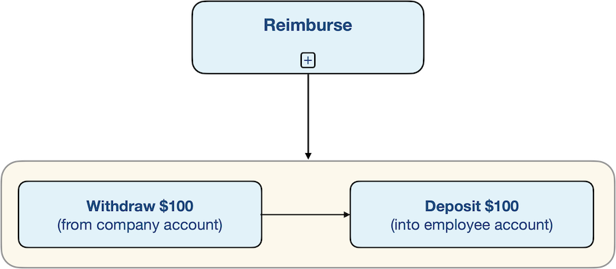

# Expense Report

> - https://temporal.talentlms.com/unit/view/id:2110

 

> - The diagram is a long-running process.
> - Depending on the organization and the number of approvals required, it may take days, weeks, or longer from start to finish.
> - Another is that there's conditional logic; just like a computer program, there are decision points and execution paths that diverge based on the outcome; if your expense report is accepted, reimbursement is the next step, bbut if it's rejected, the next step is sending a notification requesting that you modify and resubmit the report.
> - And that's another characteristic; the workflow can contain cycles; for example, because a rejected report may lead to correction, re-submission, and another review.
> - It's also worth noting that the workflow involves multiple points of human interaction, from the employee, the manager, and the accounting department.
> - It also involves external systems, notably the company's bank, which is the source of the reimbursement, and the employee's bank, which is the target of those funds.

 
 
 

# Money Transfer

> - A workflow can composed of other workflows.
> - The first step is to withdraw money from the employer's bank account and the second is to deposit th same amount into the employee's bank account.
> - There are two important constraints for doing this correctly.
> - First, you must execute both the withdrawal and the deposit.
> - Second, you must execute each of them exactly once.
> - More broadly, the reimbursement is just a transfer of money between two accounts.
> - There are plenty of other use cases for this same workflow.
> - In fact, millions of people every day depend on it when they use services like Square, Sripe, Western Union, PayPal, Venmo, Swish, or Apple Pay.
> - This workflow would typically involve multiple accounts accessed through some type of remote procedure calls, making it a distributed system.
> - As with any distribbuted system, it could fail for many reasons, including server failure or a network outage.
> - If this workflow wasn't built on Temporal, the consequences could be catastrophic.
> - If it happened to fail in the middle of this function, between the withdrawal and deposit steps, then the account balances would be incorrect.
> - Worse yet, the current state would be lost, so restarting the application would repeat the withdrawal again, rather than resuming with the deposit.
> - With Temporal Workflows, you can let the platform handle these types of failures.
