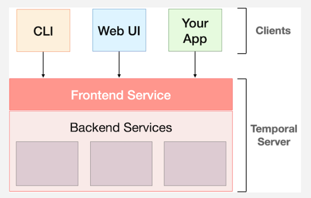

# Temporal Server

> - https://temporal.talentlms.com/unit/view/id:2111

<br />



<br />

`Temporal Server`
#

> - Consists of a frontend service, plus several backend services that work together to manage the execution of your application code.
> - All of those services are horizontally scalable and a production environment will typically run multiple instances of each, deployed across multiple machines, to increase performance and availability.

<br />

`Frontend Service`
#

> - This part of Temporal Server acts as API gateway.
> - In other words, it is a frontend for clients, not end users (those who interact with the CLI or Web UI).

<br />

Clients that communicate with the Temporal Server:
#

```plaintext
1. Temporal's command-line interface (CLI).
2. Temporal's web-based user interface (Web UI).
3. A Temporal client embedded into the applications you run.
```
