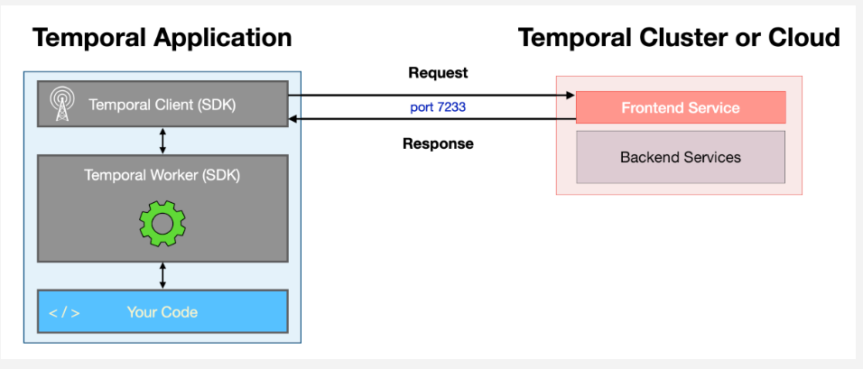
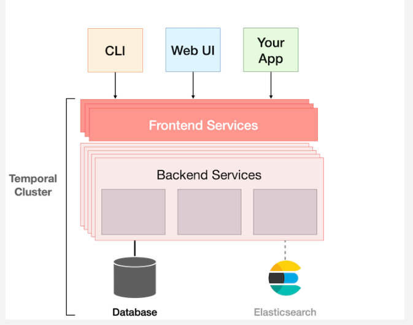

# Temporal Server

> - https://temporal.talentlms.com/unit/view/id:2111

<br />


<br />

`Temporal Server`
#

> - Consists of a frontend service, plus several backend services that work together to manage the execution of your application code.
> - All of those services are horizontally scalable and a production environment will typically run multiple instances of each, deployed across multiple machines, to increase performance and availability.

<br />

`Frontend Service`
#

> - This part of Temporal Server acts as API gateway.
> - In other words, it is a frontend for clients, not end users (those who interact with the CLI or Web UI).

<br />

Clients that communicate with the Temporal Server:
#

```plaintext
1. Temporal's command-line interface (CLI).
2. Temporal's web-based user interface (Web UI).
3. A Temporal client embedded into the applications you run.
```

<br />



> - Clients communicate with the Temporal Server by issuing requests to this Frontend Service.
> - The Frontend Service then communicates with backend services, as necessary to fulfill the request, and then returns a response to the client.
> - Communication to and within the Cluster is done using gRPC, a popular high performance open source RPC framework originally developed at Google and now part of the Cloud Native Computing Foundation ecosystem.
> - The messages themselves are encoded using Protocol Buffers, and open source serialization mechanism also originally developed at Google.
> - All of this communication can be secured with TLS, which encrypts the data as it is transmitted across the network and can also verify the identity of the client and server by validating their certificates.

<br />
<br />
<br />


# Temporal Cluster



<br />

`Temporal Cluster`
#

> - Is it the complete system, which is a deployment of the Temporal Server software on some number of machines, plust the additional components used with it.
> - The only required component is database, such as SQL.
> - This tracks the current state of every execution of your Workflows.
> - It also maintains a history of all Events that occur their executions, which it uses to reconstruct the current state in case of failure.
> - It persists this and other information, such as details related to durable timers and queues, to the database.
> - ElasticSearch is an optional component.
> - It's not necessary for basic operation, but adding it will give you advanced searching, sorting, and filtering capabilities for information about current and recent Workflow Executions.
> - This is helpful when you run Workflows millions of times and need to locate a specific one; for example, bbased on when it started, how long it took to run, or its final status.
> - Prometheus is often used to collect metrics from Temporal, while Grafana is used to create dashboards based on those metrics.
> - Together, these tools help operations teams monitor cluster and application health.

<br />
<br />
<br />


# Workers
