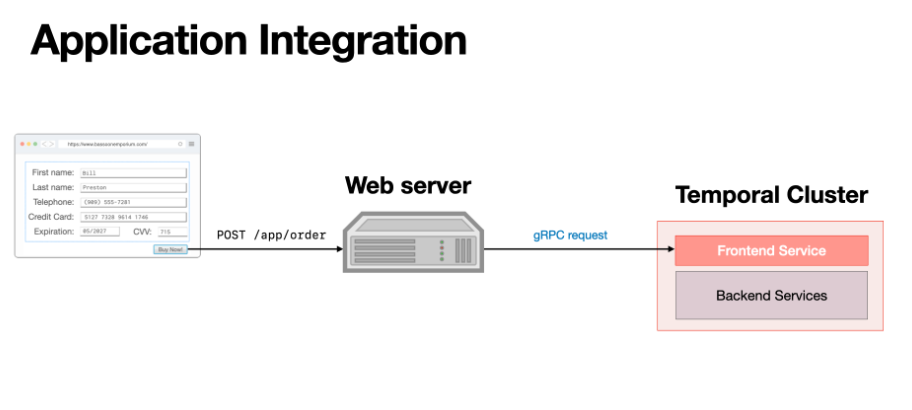

# Integrating Temporal into Other Applications

> - https://temporal.talentlms.com/unit/view/id:2541

 
 
 

# Direct Integration in Application Frontend

> - It is possible to use a Temporal Client from within those applications.
> - It is also possible to issue gRPC requests directly from the applications without using a Temporal Client at all.
> - However, both are atypical approaches.

 
 
 

# Integration through a Backend Application

> - A more typical approach is to have the end user application make calls to a service, such as a web application that provides a REST endpoint, which acts as an application gateway and uses a Temporal Client to interact with the Cluster.
