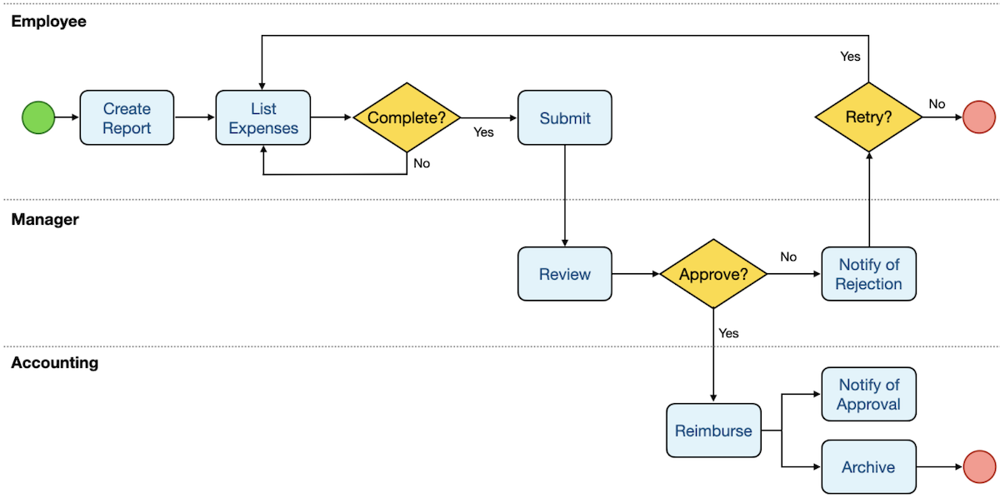

# Integrating Temporal into Other Applications

> - https://temporal.talentlms.com/unit/view/id:2541

 
 
 

# Direct Integration in Application Frontend

> - It is possible to use a Temporal Client from within those applications.
> - It is also possible to issue gRPC requests directly from the applications without using a Temporal Client at all.
> - However, both are atypical approaches.

 
 
 

# Integration through a Backend Application

> - A more typical approach is to have the end user application make calls to a service, such as a web application that provides a REST endpoint, which acts as an application gateway and uses a Temporal Client to interact with the Cluster.
> - For example, imagine that the end user submits a form in a web application, which results in a request to an endpoint associated with order processing.
> - In this case, the code running on the web server can extract data from the HTTP request and use it as input to a Workflow Execution, which it starts by using a Temporal Client.
> - This results in a gRPC request to the Temporal Cluster.
> - The web application might also provide endpoints for canceling the Workflow or retrieving its results, both of which can also be implemented by using a Temporal Client.
> - This approach is easier to support from a network security perspective, since the Temporal Cluster's Frontend service only needs to accept inbound connections from the Web Server instead of having to accept them from every end user.
